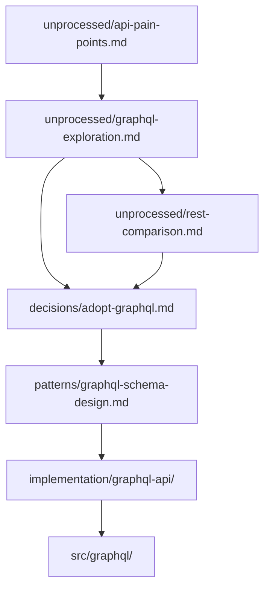

# Knowledge Lineage Pattern

## Intent
Maintain clear, traceable connections between knowledge artifacts and the code they generate, enabling understanding of why code exists and supporting regeneration.

## Motivation
Traditional development loses the "why":
- Code exists without context
- Decisions forgotten over time
- Original reasoning lost
- Difficult to modify confidently
- Regeneration impossible

Knowledge lineage provides:
- Clear knowledge-to-code paths
- Decision preservation
- Modification confidence
- Regeneration ability
- Learning from history

## Structure
```
Knowledge Flow:
docs/unprocessed/ → decisions/ → patterns/ → implementation/ → code

Lineage Tracking:
- Forward references (knowledge → code)
- Backward references (code → knowledge)  
- Implementation context files
- Commit message connections
```

## Implementation

### 1. Forward References (Knowledge → Code)
```markdown
# docs/unprocessed/2025-01-29-auth-decision.md

## Decision: JWT with Refresh Rotation

[Analysis and reasoning...]

## Implementation Guidance
When implementing:
- Use RS256 for signing
- 15-minute access tokens
- Secure httpOnly cookies

## Generated Code
- impl/auth-jwt branch
- src/auth/jwt.service.ts
- src/auth/refresh.strategy.ts
```

### 2. Backward References (Code → Knowledge)
```typescript
// src/auth/jwt.service.ts

/**
 * JWT Service Implementation
 * 
 * Based on decisions in:
 * - docs/unprocessed/2025-01-29-auth-decision.md
 * - docs/patterns/token-rotation.md
 * 
 * Key constraints from knowledge:
 * - 15-minute expiry (security vs UX balance)
 * - RS256 signing (asymmetric for microservices)
 * - Rotation on refresh (prevent token reuse)
 */
export class JWTService {
  // Implementation following documented decisions
}
```

### 3. Implementation Context Files
```markdown
# implementation/sessions/2025-01-31-auth/context.md

## Implementation Context

### Source Knowledge
- Primary: docs/unprocessed/2025-01-29-auth-decision.md
- Pattern: docs/patterns/token-rotation.md
- Discussion: docs/unprocessed/2025-01-28-team-auth-sync.md

### Key Decisions Applied
1. JWT over sessions (scalability)
2. Short-lived tokens (security)
3. Rotation strategy (hijack prevention)

### Generated Files
- src/auth/jwt.service.ts
- src/auth/refresh.strategy.ts
- src/middleware/auth.guard.ts
- tests/auth/jwt.spec.ts

### Deviations from Plan
- Used 20 minutes instead of 15 (mobile app requirement)
- Added device fingerprinting (security enhancement)
```

### 4. Commit Message Lineage
```bash
# When implementing
git commit -m "Implement JWT auth from docs/unprocessed/2025-01-29-auth-decision.md

Based on team decision for stateless auth.
Key constraints:
- 15-minute tokens
- Refresh rotation
- Secure storage

See: docs/unprocessed/2025-01-29-auth-decision.md"
```

### 5. PR Description Lineage
```markdown
## Implementation: JWT Authentication

### Knowledge Sources
- Flow exploration: flow/auth-exploration (3 days)
- Decision doc: docs/unprocessed/2025-01-29-auth-decision.md
- Pattern applied: docs/patterns/token-rotation.md

### Lineage Graph
```
auth-exploration → auth-decision.md → token-rotation.md → this PR
        ↓                                      ↓
   team-sync.md ←────────────────────────────┘
```

### What This Implements
The JWT strategy we decided on, with all constraints from our knowledge base.
```

## Examples

### Simple Lineage
```bash
# Knowledge
echo "Use PostgreSQL for strong consistency" > \
  docs/unprocessed/2025-01-30-database-choice.md

# Implementation
cat > implementation/current/database-setup.md << EOF
# Database Setup
Based on: docs/unprocessed/2025-01-30-database-choice.md
Implementing: PostgreSQL with strong consistency
EOF

# Code
cat > src/config/database.ts << EOF
// Database Configuration
// Decision: docs/unprocessed/2025-01-30-database-choice.md
export const dbConfig = {
  type: 'postgres',
  synchronize: false, // Strong consistency requires migrations
}
EOF
```

### Complex Lineage


### Regeneration Using Lineage
```bash
# Code is corrupted/lost/outdated
rm -rf src/auth/

# Check lineage
grep -r "src/auth" docs/unprocessed/
# Found: docs/unprocessed/2025-01-29-auth-decision.md

# Regenerate from knowledge
echo "Regenerate auth from docs/unprocessed/2025-01-29-auth-decision.md" | ai-assist

# Fresh implementation, possibly improved
```

## Consequences

### Benefits
- **Never lose context**: Always know why code exists
- **Confident changes**: Understand original constraints
- **Knowledge archaeology**: Trace decisions through time
- **Regeneration ability**: Rebuild from understanding
- **Team learning**: See how decisions evolved

### Considerations
- Requires discipline to maintain references
- Links can become stale (needs verification)
- Initial overhead in documentation
- Search tools become important
- Team training needed

### Lineage Health Checks
- [ ] Every implementation references knowledge
- [ ] Key decisions have forward references  
- [ ] Code comments include knowledge links
- [ ] PRs show lineage graphs
- [ ] Can trace any code to its origin

### Anti-patterns
- Orphan code (no knowledge parent)
- Broken links (knowledge deleted)
- Vague references ("based on discussion")
- Missing implementation contexts
- One-way references only

## Related Patterns
- [Knowledge First](../core/knowledge-first.md) - Source of lineage
- [Implementation Branches](../workflow/implementation-branches.md) - Lineage workflow
- [Regeneration](../core/regeneration.md) - Why lineage matters
- [Temporal Integrity](../core/temporal-integrity.md) - Time in lineage