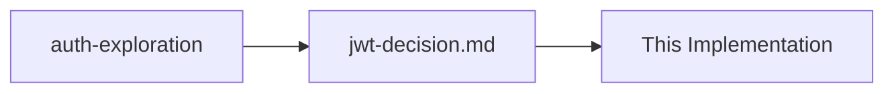

# PR as Review Pattern

## Intent
Transform pull requests from code review ceremonies into knowledge validation and sharing opportunities.

## Motivation
Traditional PR reviews focus on:
- Syntax and style issues
- Potential bugs
- Performance concerns
- Test coverage
- Naming conventions

But miss the bigger questions:
- Why was this approach chosen?
- What alternatives were considered?
- What knowledge was gained?
- What patterns emerged?
- How does this evolve our understanding?

By treating PRs as knowledge reviews:
- Share understanding across team
- Validate decisions collectively
- Build institutional knowledge
- Focus on what matters
- Create learning opportunities

## Structure
```
PR Content
├── Knowledge artifacts (docs/unprocessed/)
├── Implementation context
├── Decision documentation
├── Code (if impl branch)
└── Learning summary
```

## Implementation

### 1. Flow Branch PRs
```markdown
# PR: flow/auth-exploration → main

## 🌊 Flow Session Summary
Duration: 2 days of exploration
Energy: High → Medium → Harvest

## 🧠 Knowledge Gained
- JWT vs Session trade-offs understood
- Discovered refresh rotation pattern
- Identified mobile app constraints
- Found security considerations

## 📚 Artifacts Created
- `docs/unprocessed/2025-01-29-auth-analysis.md`
- `docs/unprocessed/2025-01-29-jwt-decision.md`
- `explorations/session-scaling-issues.md`
- `explorations/oauth-consideration.md`

## 🎯 Key Decisions
1. Use JWT for stateless auth (see: auth-analysis.md)
2. Implement refresh rotation (see: jwt-decision.md)
3. 15-minute access tokens (security vs convenience)

## 🤔 Open Questions
- How to handle token revocation at scale?
- Should we implement device tracking?

## 👀 Please Review
- Are the trade-offs well documented?
- Any security concerns missed?
- Additional patterns to consider?
```

### 2. Implementation Branch PRs
```markdown
# PR: impl/auth-jwt → main

## 🏗️ Implementation Summary
Based on knowledge from: `flow/auth-exploration`
Implements decisions in: `docs/unprocessed/2025-01-29-jwt-decision.md`

## 📋 What This Implements
From our explorations, we decided:
- ✅ JWT with RS256 signing
- ✅ 15-minute access tokens
- ✅ 7-day refresh tokens with rotation
- ✅ Secure httpOnly cookies

## 🔗 Knowledge Lineage


## 💻 Code Structure
- `src/auth/jwt.service.ts` - Token generation
- `src/auth/refresh.service.ts` - Rotation logic
- `src/middleware/auth.guard.ts` - Request validation
- `src/config/auth.config.ts` - Configuration

## 🧪 Validation
- Unit tests follow decision constraints
- Integration tests verify rotation
- Security tests check token expiry

## 👀 Please Validate
- Does implementation match our decisions?
- Are knowledge references clear?
- Any patterns we should extract?
```

### 3. Review Comments Focus
```markdown
# Instead of:
"This variable should be camelCase"
"Missing semicolon on line 42"

# Focus on:
"This timeout differs from our decision doc - intentional?"
"Have we captured why we chose Redis over memory store?"
"This pattern might be worth documenting in unprocessed/"
"The retry logic here is clever - should we extract this knowledge?"
```

### 4. PR Templates
```markdown
<!-- For Flow Branches -->
## Flow Session Report
- Duration: 
- Energy levels:
- Key insights:
- Decisions made:
- Questions raised:

## Knowledge Artifacts
- [ ] Added to docs/unprocessed/
- [ ] Timestamped properly
- [ ] Linked explorations

<!-- For Implementation Branches -->
## Implementation Context
- Based on knowledge from:
- Implements decisions in:
- Key constraints followed:

## Validation
- [ ] Matches documented decisions
- [ ] Includes knowledge references
- [ ] Tests verify constraints
```

## Examples

### Knowledge Discovery PR
```markdown
# PR: flow/performance-investigation → main

## 🔍 Investigation Results

Discovered our API slowness came from N+1 queries in the user service.

### Key Findings (see docs/unprocessed/2025-01-30-n+1-analysis.md)
1. UserService.getWithRoles() makes 1 + N queries
2. Happens on every dashboard load
3. Gets worse with more users

### Solution Explored
- Eager loading with JOIN
- DataLoader pattern  
- Query result caching

### Recommendation
DataLoader pattern (see analysis doc for why)

### Please Review
The knowledge, not the code!
```

### Pattern Extraction PR
```markdown
# PR: flow/pattern-recognition → main

## 🎯 Pattern Recognized

After three similar implementations, I've identified our "Retry with Backoff" pattern.

### Pattern Details (docs/unprocessed/retry-pattern.md)
- Exponential backoff: 1s, 2s, 4s, 8s
- Max 4 attempts
- Jitter to prevent thundering herd
- Circuit breaker after 3 failures

### Where We Use This
1. External API calls
2. Database connections
3. Message queue operations

### Suggestion
Extract to shared library?
```

## Consequences

### Benefits
- **Knowledge sharing**: Team learns from explorations
- **Decision validation**: Collective wisdom applied
- **Pattern recognition**: Reviewers spot additional patterns
- **Context preservation**: PRs become knowledge artifacts
- **Focus on value**: Less nitpicking, more learning

### Considerations
- Different from traditional reviews
- Requires mindset shift
- May need PR template updates
- Knowledge review skills develop over time
- Code style still matters (use linters)

### Signs of Good Knowledge Reviews
- Comments reference documentation
- Reviewers ask "why" questions
- Patterns get identified
- Knowledge gaps spotted
- Team understanding grows

## Related Patterns
- [Knowledge First](../core/knowledge-first.md) - Why we review knowledge
- [Flow Branches](flow-branches.md) - Exploration PRs
- [Implementation Branches](implementation-branches.md) - Building PRs
- [Harvest Protocol](harvest-protocol.md) - What gets reviewed